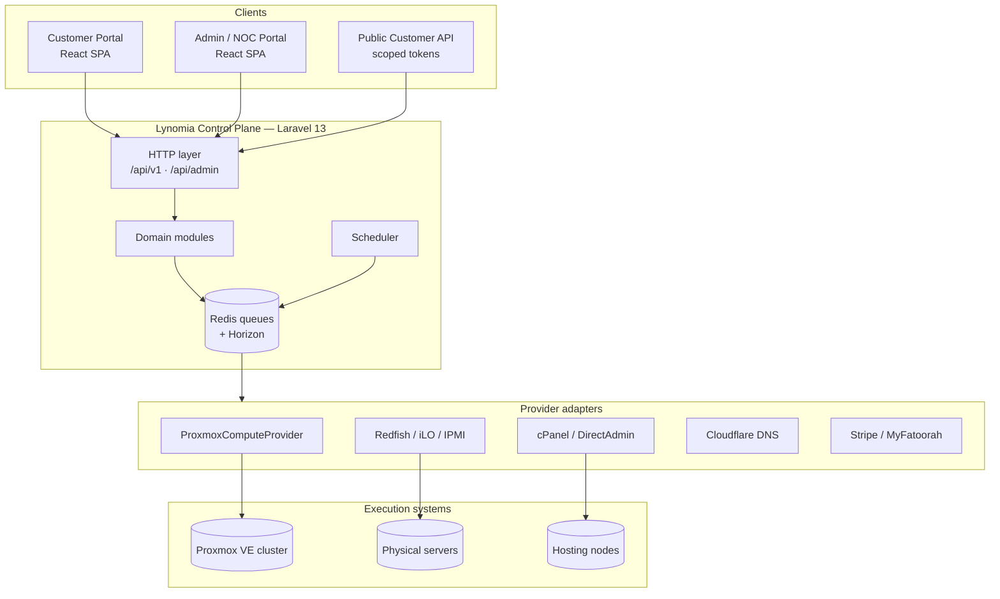
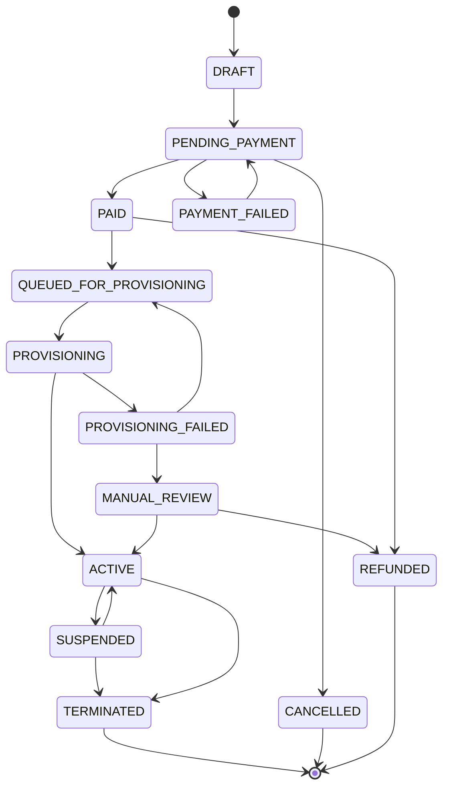
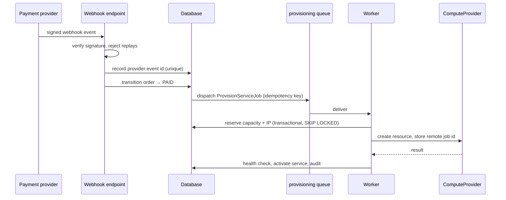

# Architecture

## 1. Position of the platform

Lynomia Cloud is a **control plane**. It owns customers, catalogue, orders,
billing, services, IP address management and the provisioning workflow. It does
not own compute, storage or hosting execution — those live in Proxmox VE,
physical servers reached over Redfish/iLO/IPMI, and cPanel/DirectAdmin nodes.

The Lynomia database is the source of truth for **commercial and service
state**. The providers are the source of truth for **execution state**. The two
inevitably drift, so drift is a first-class modelled concept (see §9), never an
assumption that they stay in sync.



## 2. Why an API + SPA split

The public customer API with scoped tokens is a product requirement, not an
afterthought. Building the portals on the same versioned API guarantees there is
exactly one implementation of every operation, and that anything a customer can
do in the UI they can also do programmatically. A server-rendered portal would
have produced two code paths for the same behaviour.

Authentication therefore has two modes against one API:

| Consumer | Mechanism |
|---|---|
| Customer & admin portals | Sanctum SPA cookie session, CSRF-protected, same-site |
| Public customer API | Personal access tokens with explicit scopes, rate limited |

## 3. Modular monolith

A distributed system is not warranted at this stage and would multiply the
operational surface of a platform that already has to operate hypervisors,
BMCs and hosting panels. Instead the control plane is a **modular monolith**:
one deployable, hard internal boundaries.

```text
apps/control-plane/src/Modules/<Module>/
  ├── Domain/          entities, value objects, enums, domain events, exceptions
  ├── Application/     use-case actions, DTOs, policies, read models
  ├── Infrastructure/  Eloquent models, repositories, provider adapters, migrations
  └── Http/            controllers, form requests, API resources, routes
```

Rules enforced by review and static analysis:

- A module may depend on another module's `Domain` contracts and published
  events. It may not reach into another module's `Infrastructure`.
- No module-crossing Eloquent relationships where an ID plus a repository call
  is sufficient.
- Controllers orchestrate; they contain no business rules.
- There is no `Services/` dumping ground and no single god-service.

Modules: Identity, Customers, Organizations, Rbac, Catalog, Orders, Payments,
Billing, Wallet, Subscriptions, Provisioning, Vps, Dedicated, SharedHosting,
Ipam, Networks, Dns, Backups, Monitoring, Support, Notifications, Audit,
Security, InfrastructureInventory, Usage, ApiKeys, Settings.

## 4. Provider abstraction

Business logic never names a vendor. It depends on interfaces:

```text
ComputeProvider       ← ProxmoxComputeProvider        · FakeComputeProvider
DedicatedProvider     ← RedfishDedicatedProvider
                        IloDedicatedProvider
                        IpmiDedicatedProvider          · FakeDedicatedProvider
HostingProvider       ← CpanelHostingProvider
                        DirectAdminHostingProvider     · FakeHostingProvider
DnsProvider           ← CloudflareDnsProvider          · FakeDnsProvider
PaymentProvider       ← StripePaymentProvider
                        MyFatoorahPaymentProvider      · FakePaymentProvider
BackupProvider        ← ProxmoxBackupServerProvider    · FakeBackupProvider
MonitoringProvider    ← PrometheusMonitoringProvider
NotificationProvider  ← MailNotificationProvider, DatabaseNotificationProvider
```

Fake providers exist for automated tests and local development only. Their
service provider throws at boot when `APP_ENV=production`, so a
misconfigured production deployment fails loudly instead of silently pretending
to provision machines.

## 5. Identity and authorisation

Permissions live in the database and are checked through Laravel policies and
gates. There are no `if ($user->role === 'admin')` checks anywhere. Roles are
groupings of permissions and are editable; the code depends on permissions.

Two-factor authentication is TOTP-based with single-use recovery codes.
Sessions and API tokens are individually listable and revocable by the owner.

## 6. Money

Money is never a float and never a bare integer. It is a `Money` value object
backed by `brick/money`, stored as an integer number of **minor units** plus an
ISO-4217 currency code, in a `bigint` column paired with a `char(3)` column.
Rounding mode is explicit at every arithmetic site. Currency mixing throws.

Invoice numbers are allocated from a database sequence under a transaction,
are immutable once issued, and follow a configurable format.

## 7. Order state machine



Every transition is persisted with the actor (user, system, webhook, job), the
reason and a correlation ID. Illegal transitions throw rather than silently
no-op.

## 8. Provisioning engine

Provisioning never runs inside an HTTP request. A payment confirmed
**server-side** emits `OrderPaid`, which creates a `ProvisioningJob` row and
dispatches a queued job.



Guarantees:

- **Idempotency.** Each job carries a unique idempotency key; the table has a
  unique constraint on it. A retry, a duplicate webhook or a double-clicked
  purchase converges on one resource.
- **Remote job tracking.** The provider's own job/task ID is persisted before
  the call is considered in flight, so a timeout after resource creation is
  recoverable rather than duplicated.
- **Bounded retries** with exponential backoff, then `MANUAL_REVIEW` — never an
  infinite loop against a failing hypervisor.
- **Compensation.** Failure releases or quarantines reserved resources
  according to failure class. A timeout quarantines rather than releases,
  because the resource may in fact exist.
- **Sanitised metadata.** Provider responses are stored with credentials and
  tokens redacted.

## 9. Reconciliation and drift

Scheduled reconciliation workers compare Lynomia state against each provider.
Drift is recorded and alerted, never auto-healed destructively:

| Situation | Action |
|---|---|
| Lynomia says ACTIVE, provider has no such resource | Flag drift, alert, **do not** create a replacement |
| Provider has a resource with no Lynomia service | Flag as orphan, surface to admins |
| Power/state mismatch | Update the read model, record the correction |

Administrators get a dedicated drift/consistency view.

## 10. IPAM concurrency

IP allocation is the classic double-allocation hazard. Allocation runs inside a
transaction using `SELECT … FOR UPDATE SKIP LOCKED` against the candidate pool,
so two concurrent provisioning jobs can never receive the same address. The
address row moves `available → reserved → assigned` with the reservation tied to
the provisioning job, and a reservation that outlives its job is reaped by a
scheduled worker.

## 11. Queues

| Queue | Purpose |
|---|---|
| `critical` | Security and account-safety operations |
| `payments` | Webhook processing, captures, refunds, reconciliation |
| `provisioning` | Resource creation, deletion, lifecycle actions |
| `infrastructure` | Capacity sync, inventory sync, node maintenance |
| `notifications` | Mail and in-app delivery |
| `monitoring` | Metric and health collection |
| `default` | Everything else |

Horizon supervises them with per-queue concurrency, timeouts and backoff.

## 12. Observability

Structured JSON logs carry correlation IDs (`request_id`, `order_id`,
`provisioning_job_id`, `service_id`, `customer_id`) and are shipped by Grafana
Alloy to Loki. Promtail is deliberately not used — it is end-of-life.

Metrics go to Prometheus, alerts to Alertmanager, dashboards to Grafana.
Secrets, passwords, private keys, BMC credentials and card data are redacted by
a logging processor before anything is written.

## 13. Network separation

The platform assumes and documents separate VLANs for management, compute,
customer/public, storage, backup, provisioning/PXE and monitoring traffic. No
VLAN ID is hardcoded anywhere; every value comes from infrastructure inventory.
BMC interfaces stay on an isolated management network and are never exposed to
customer networks. Proxmox administrative interfaces are not publicly exposed by
default.

## 14. Deployment topology

Roles are separate machines. The control plane never runs on a hypervisor, a
hosting node or a firewall.

```text
control_plane   Laravel API, workers, scheduler, Nginx
database        PostgreSQL 18 (primary, optional replica)
redis           Redis (queues, cache, sessions)
monitoring      Prometheus, Alertmanager, Grafana, Loki
proxmox         Proxmox VE hypervisors (bare metal)
pbs             Proxmox Backup Server (dedicated)
hosting         cPanel / DirectAdmin nodes (bare metal or VM)
dedicated       Customer physical servers (inventory only)
pxe             iPXE/DHCP on the isolated provisioning VLAN only
firewall        OPNsense — only where explicitly declared re-imageable
```
